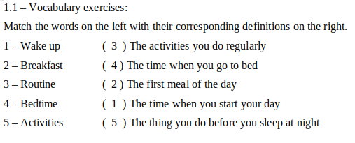

# Everyday activies and work routine

## Class 1 - Content: Everyday activities and routine

mug - caneca 
dry off - secar 
towel - toalha 
i get dressed - eu me visto / estou vestido 
shave - barba 
grab - pegar

### Exercício 1.1

### Exercício 1.2
I wake up at 7:30 in the morning but i get up at 8:00 on clock. So after i get up, i go the bathroom. After leaving the shower, i go to grocery to buy bread for my breakfast.
I work from Home Office. I start work at 9:00 in the morning and a finish at 17:00.

## Class 2 - Content: Everyday activities and routine

1-What time do you get up?

I get up at 8:00 on clock in the morning
 

2-Do you have breakfast in the morning? What do you have for breakfast?

I have breakfast, i eat bread, eggs and coffee
 

3-How do you go to work or school?

 

4-What time do you start work or school?

 

5-What do you do in the morning?

 

6-Do you have lunch at home?

 

7-What do you normally have for lunch?

 

8-What do you do in the afternoon?

 

9-What do you do after work or school?

 

10-Do you relax in the evening? What do you do?

 

11-What time do you go to bed?

 

12-When do you check your social media?

 

13-How many hours are you online every day?

 

14-What activities do you like to do?

 

15-What good habits do you have?

 

16-What do you do in your free time?

 

17-Do you think it is important to have a daily routine? Why or why not?

 

18-Do you plan what you do each day? Why or why not?

 

19-How do you organize your study time?

 

20-What do you want to change in your daily routine? Why?

i want to change my time of studing, but i don't have more time for studing
 

## 3 – Reading and vocabulary:

I’m a live music promoter. I work for a small company in Sydney. We find new bands and promote them – we sell tickets, print posters, book the venues - things like that.
My typical working day is pretty long. First of all I arrive at the office early – around eight or eight-thirty. Then I check my e-mails. I usually have a lot of messages from bands and booking agencies. Next, I talk to the management team to check the program of events. After that, I usually have meetings. I spend the afternoon meeting clients – sometimes two or three meetings a day. Finally, in the evenings, I watch the bands perform, or I go looking for new acts. I really like my job. It’s very interesting and I meet lots of different people.

## Speaking

Ask and answer these questions about work routine:

 

1-What is the first thing you do when you arrive work?

I turn on my computer, log into Discord and sit down on my table virtual
 

2-How many times a day do you send work messages?

I send messages for my coworkers all the day
 

3-What motivates you at your work?

My family, i my yourself and my future
 

4-What qualities does your boss have?

He is very cool and intelligent
 

5-What qualities are necessary to do your job?

Need to have knowledge of React with typescript
 

6-Do you socialize with your work colleagues outside work? Why? Why not?

Yes, we socialize. We usually go to karaoke.
 

7-Does your company use a flexible time system? Why? Why not?

My company use a flexible time system. When working during business hours
 

8-What is the atmosphere like at your workplace?

It's a pleasant atmosphere
 

9-What things do you do at work that are related to the subjects you study at faculty?

All my work is college related
 

10-How often does your boss ask for you to work overtime?

i don't work overtime. My company doesn't ask
 

11-What career goals do you have?

I intend to continue studying to improve my career
 

12- How has technology changed business? Do you think it's created more work or less?

Due to technology, many things have changed and people needed to adapt so as not to be left behind.
 

13- Would you prefer to have an easy routine job or a job in which you made a lot of decisions? Why?

I like the middle ground. No more and no less.
 

14- What three things are most important for you in a job? Why?

Good environment, good structure and good co-workers
 

15- Would you like a job that involved a lot of travel? Why or why not?

I would like. It would be cool to meet new people and places.
 

16- If you could own your own business, what would it be?

I want to have a fishing spot. There will be forró every weekend and more people.
