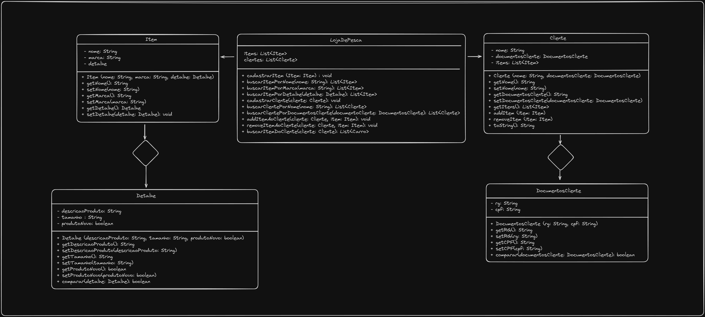

# Atividade 1
# dontpad.com/engenhariadesoftwarefatec

<b>Descrição da atividade:</b>

Within Google, we sometimes say, “Software engineering is programming integrated over time.” Programming is certainly a significant part of software : engineering after all, programming is how you generate new software in the first place. If you accept this distinction, it also becomes clear that we might need to delineate between programming tasks (development) and software engineering tasks (development, modification, maintenance). The addition of time adds an important new dimension to programming. Cubes aren’t squares, distance isn’t velocity. Software engineering isn’t programming.

We see three critical differences between programming and software engineering: time, scale, and the trade-offs at play. On a software engineering project, engineers need to be more concerned with the passage of time and the eventual need for change. In a software engineering organization, we need to be more concerned about scale and efficiency, both for the software we produce as well as for the organization that is producing it. Finally, as software engineers, we are asked to make more complex decisions with higher-stakes outcomes, often based on imprecise estimates of time and growth.

<b>Link para o livro: </b><a href="https://abseil.io/resources/swe-book">https://abseil.io/resources/swe-book</a>

## O que é engenharia de software?

É programação porém com mais: <b>tempo, escala e trade-offs</b>

<b>Tempo: </b>Envolve a gestão eficaz do cronograma de desenvolvimento, incluindo a definição de prazos realistas, a alocação adequada de recursos e o planejamento das atividades de desenvolvimento de acordo com os marcos temporais definidos. Isso inclui a utilização de metodologias de desenvolvimento ágeis ou tradicionais, dependendo das necessidades do projeto, para garantir que o software seja entregue dentro do prazo estipulado.

<b>Escala: </b>Lida com a complexidade e o tamanho dos sistemas de software que estão sendo desenvolvidos. Isso envolve a divisão do projeto em componentes menores, como módulos ou funcionalidades, para facilitar o desenvolvimento, teste e manutenção. Além disso, a escalabilidade do software é uma consideração importante, garantindo que o sistema possa lidar com um aumento na demanda ou na complexidade sem comprometer sua funcionalidade ou desempenho

<Porque><b>Trade-offs: </b>Porque utilizar determinadas tecnologias? Neste ponto destacamos quais são os pontos positivos e negativos ao realizar uma escolha (O que ganhamos e perdemos ao escolher determinada tecnologia em relação a outra). Pode ser referenciado como "Jogo de perde e ganha"."Eu assumo tomar esse prejuizo por não escolher essa linguagem/framework".

  

# Atividade 2 - Cite 3 exemplos de Trade-offs:

<b>Descrição da atividade: </b>

Nas aulas de sexta discutimos sobre Engenharia de Software e trade-offs. Alguns dos exemplos discutidos foram Java (Portabilidade) X Python (Simplicidade), BD Relacional X NoSQL, Usabilidade X Desempenho e outros...
Agora, no seu repositório "bertoti" pasta "engenhariadesoftware", depois da atividade número 1 de comentar os dois parágrafos do livro, faça a atividade número 2 que é citar 3 exemplos de trade-offs (em software) e explicá-los conforme comentários que fizemos na sexta.
 

## 
<b>1º Exemplo: Html, Css e JavaScript vs React</b>

 Ao desenvolver uma Landing Page, pode ser mais interessante optar por usar HTML, CSS e JavaScript em vez de usar um framework como React. Desenvolvendo o projeto sem o framework, você ganha mais independência, além de deixar o projeto mais leve e com menor custo de desenvolvimento.

<b>Requisitos funcionais</b>

<ul>
    <li>Carregamento rápido</li>
    <li>Compatibilidade</li>
</ul>

<b>Requisitos não funcionais</b>

<ul>
    <li>Performance</li>
    <li>Fácil manutenção</li>
</ul>

 

## 
<b>2º Exemplo: Css Puro vs Bootstrap</b>

Ao desenvolver uma Landing Page, pode ser interessante escolher entre usar CSS puro ou o framework Bootstrap. Optar pelo CSS puro oferece mais flexibilidade e controle sobre o design, enquanto o Bootstrap pode agilizar o processo de desenvolvimento, fornecendo 
componentes pré-projetados e uma grade responsiva. Ao utilizar o Bootstrap você tem:

<b>Requisitos funcionais</b>

<ul>
    <li>Fácil responsividade</li>
    <li>Estilo consistente</li>
</ul>

<b>Requisitos não funcionais</b>

<ul>
    <li>Inflexibilidade</li>
    <li>Dificuldade técnica</li>
</ul>

 

## 
<b>3º Exemplo:</b>

Ao desenvolver um aplicativo móvel, pode-se optar entre utilizar o React Native ou o desenvolvimento nativo para plataformas específicas, como iOS e Android. O React Native oferece a vantagem de permitir o desenvolvimento de aplicativos para ambas as plataformas usando uma base de código comum, enquanto o desenvolvimento nativo requer a criação de aplicativos separados para cada plataforma.

<b>Requisitos funcionais</b>

<ul>
    <li>Desenvolvimento para múltiplas plataformas com uma base de código comum.</li>
    <li>Maior velocidade de desenvolvimento devido à reutilização de componentes.</li>
</ul>

<b>Requisitos não funcionais</b>

<ul>
    <li>Possível comprometimento de desempenho em comparação com o desenvolvimento nativo otimizado.</li>
    <li>Dependência das atualizações e suporte do React Native pela comunidade e pelo Facebook.</li>
</ul>

  

# Atividade 3

<b>Arquitetura, slides 24 - 29: </b>Explicar sobre cada arquitetura

<b>Arquitetura de camadas: </b>Uma arquitetura de camadas é um modelo de organização de sistemas de software em diferentes níveis de abstração, com cada camada sendo responsável por um conjunto específico de funcionalidades. Geralmente utilizado para sistemas que não precisam ser escalados, simples e não precisa de uma máquina potente para funcionamento.

<b>Um ponto forte: </b>Simplicidade, fácil de criar e para realizar manutenção no sistema, não necessita de desenvolvedores experientes para realizar as manutenções.

<b>Um ponto fraco: </b>Tolerança a falha, pois se acontecer alguma falha no sistema, pode ocorrer falhas em cascata, fazendo todo o sistema quebrar.
 

<b>Arquitetura Pipeline: </b>Arquitetura de processamento de dados que organiza e executa uma série de etapas em sequência, onde a saída de uma etapa se torna a entrada da próxima

Anotações sobre a explicação do professor: É processar coisas sequencialmente. Utilizado bastante em aplicações de ciência de dados. Ex: Uma grande fonte de dados que precisa deixar os dados anônimos na plataforma (dados sensiveis), extrair o dado, transformar o dado e carregar o dado, Ex: Proteger senhas, CPF, checkout. ETL

<b>Um ponto forte: </b>Baixo custo, pois é fácil de realizar manutenção e também o projeto acaba sendo mais barato.

<b>Um ponto fraco: </b>Tolerança a falhas, pois se um método quebrar, o sistema todo pode quebrar por conta de uma resposta de nível de acoplamento grande.
 

<b>Arquitetura MicroKernel: </b>É um tipo de kernel de sistema operacional que contém apenas as funcionalidades essenciais, com a maioria dos serviços sendo executados como processos de usuário. Isso torna o sistema mais modular e fácil de manter, mas pode afetar ligeiramente o desempenho devido à comunicação entre processos.

<b>Anotações sobre a explicação do professor:</b> Arquitetura utilizada no sistema operacional, onde tem um sistema principal e diversos plugins do sistema. Ex plugins: Interface gráfica./p>

<b>Um ponto forte: </b>Custo Geral - A arquitetura MicroKernel permite a redução dos custos gerais de desenvolvimento e manutenção de sistemas, devido à sua modularidade e capacidade de reutilização de componentes.

<b>Um ponto fraco: </b>Tolerância ao Erro - A tolerância ao erro pode ser comprometida, pois a comunicação entre os diferentes componentes do sistema através de processos de usuário pode aumentar a complexidade e introduzir pontos potenciais de falha.
 

<b>Arquitetura Service-Based: </b>

<b>Anotações da explicação do professor:</b> Utilizado para software de serviços. Seria um update da arquitetura de camadas. 
Estilo arquitetônico de software onde as funcionalidades do sistema são implementadas como serviços independentes e interoperáveis. Cada serviço é uma unidade de software autônoma que realiza uma função específica e se comunica com outros serviços por meio de interfaces bem definidas. Esta abordagem facilita a construção de sistemas modulares e escaláveis, onde novos serviços podem ser adicionados ou atualizados sem afetar o sistema como um todo.

<b>Um ponto forte: </b>Testabilidade - Como os serviços são independentes, é mais fácil testar cada um deles separadamente, garantindo a qualidade do software como um todo. Isso facilita a identificação e correção de erros em um ambiente de desenvolvimento e teste.

<b>Um ponto fraco: </b>Elasticidade - Com a arquitetura service-based, podemos adicionar mais partes conforme necessário. Porém, à medida que o sistema cresce, coordenar essas partes pode ficar mais complexo, afetando a capacidade de resposta em momentos de grande demanda.
 

<b>Arquitetura Event-Driven (Orientado por eventos): </b>É um estilo arquitetônico em que o fluxo de dados e controle é determinado pela ocorrência de eventos e pela reação a esses eventos. Neste modelo, os componentes do sistema se comunicam através da emissão e captura de eventos, permitindo uma comunicação assíncrona e desacoplada entre eles.

<b>Anotações da explicação do professor: Exemplo do pix: </b>m exemplo de arquitetura Event-Driven é a notificação de pagamento. Quando um usuário realiza um pagamento, um evento de pagamento é gerado e propagado através do sistema. Diferentes componentes, como o banco do pagador e do recebedor, podem reagir a esse evento, atualizando seus respectivos registros e notificando os usuários envolvidos.

<b>Um ponto forte: </b>Escalabilidade - altamente escalável, pois permite que os componentes do sistema sejam adicionados ou removidos facilmente, respondendo dinamicamente ao aumento ou diminuição da carga de eventos.

<b>Um ponto fraco: </b>Simplicidade - A complexidade pode aumentar devido à natureza assíncrona e desacoplada da comunicação entre os componentes. Isso pode tornar a compreensão e manutenção do sistema mais difícil, necessitando assim de desenvolvedores mais experientes para a realização da manutenção ou melhorias no projeto.
 

<b>Arquitetura Microservices: </b>É um modelo de desenvolvimento de software onde uma aplicação é dividida em pequenos serviços independentes, cada um responsável por uma função específica. Esses serviços se comunicam entre si através de protocolos leves, como HTTP, e podem ser desenvolvidos, implantados e escalados de forma independente. Isso proporciona maior flexibilidade, agilidade e facilita a manutenção contínua da aplicação. No entanto, a gestão da comunicação entre os serviços e o monitoramento são desafios importantes.

<b>Um ponto forte: </b> Escalabilidade, pois para inserir um novo microserviço, ele não necessita dos outros microserviços existestes para ser atrelado, sendo assim, ficando mais fácil para fazer a implementação sem causar conflitos com os demais existentes.

<b>Um ponto fraco: </b>Alto custo, pois para realizar a manutenção dos microserviços, necessita de desenvolvedores mais experientes.

<b></b>

  

# Atividade 4
## Definir a arquitetura que será utilizada na aplicação relatando os requisitos não funcionais do tradeoff:
### Modelo escolhido: MVC

<b>Modelo: </b>Representa os dados e a lógica de negócios, sendo responsável pela manipulação e validação das informações.
</b>

<b>Visão: </b>Corresponde à camada de apresentação, exibindo informações ao usuário e capturando suas entradas.
</b>

<b>Controlador: </b>Atua como intermediário entre a Visão e o Modelo, processando as entradas do usuário recebidas pela Visão, aplicando a lógica de negócios do Modelo e atualizando a Visão conforme necessário.
</b>

### Compensações com requisitos não funcionais:

<b>Desempenho: </b>A divisão de responsabilidades no MVC pode aumentar a complexidade e potencialmente reduzir o desempenho devido ao processamento adicional necessário para coordenar as diferentes camadas.

<b>Escalabilidade: </b>A arquitetura MVC facilita a escalabilidade, pois a separação de responsabilidades permite uma manutenção mais simples e o desenvolvimento paralelo.

<b>Manutenibilidade: </b>A clara divisão de responsabilidades entre as camadas torna a manutenção mais fácil, uma vez que as mudanças em uma parte do sistema tendem a impactar menos as outras partes.

<b>Segurança: </b>A separação em camadas possibilita a implementação de medidas de segurança em diferentes níveis, como a validação de entrada no Controlador e a autenticação e autorização em outras camadas.

  

# Atividade 5
## Diagrama de classes UML:

  

# Atividade 6

Desenvolver uma aplicação a partir do diagrama de classes

  

# Atividade 7

Desenvolver testes na aplicação
