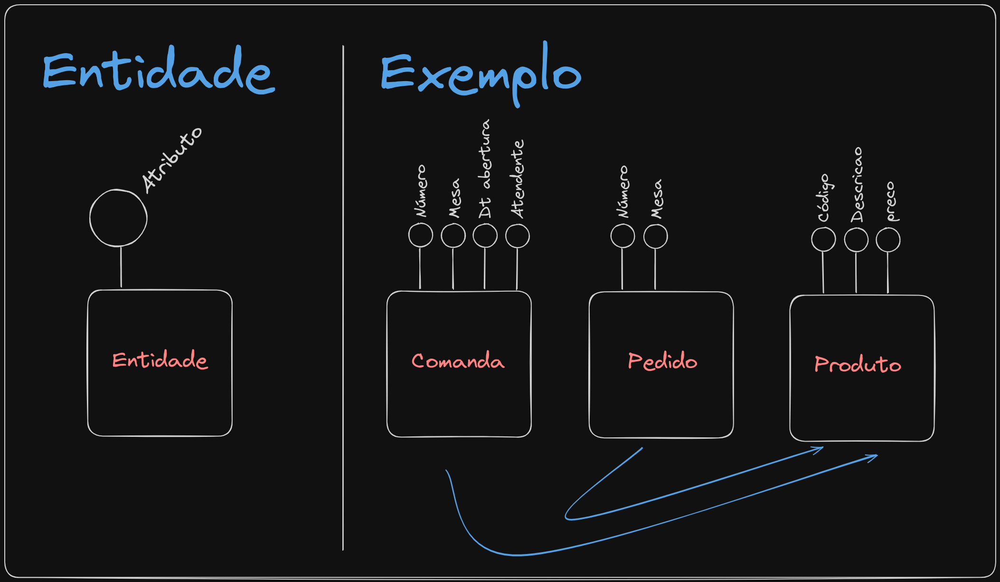

# Dia 01 de Março

Professor explicando sobre modelagem. Sobre não fazer todo o front de uma vez, nem todo o back tudo de uma vez. Fazer uma mescla entre ambos.

<b>Exemplo dado:</b> Comanda de algum estabelecimento.

## Entidade:
<ul>
    <li>São os <b>conceitos</b> armazenados no banco. <b>Características que preciso armazenar</b> (Exemplo: A comanda possui número, data, nome ...)</li>
    <li><b>É obrigratório ter característica</b></li>
    <li>Pode existir de verdade ou não.</li>
    <li>São representadas com um <b>RETÂNGULO</b></li>
</ul>

